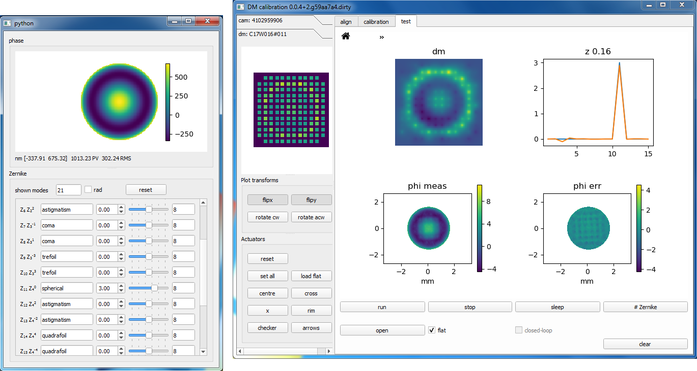

# dmlib
Python library for calibration and control of deformable mirrors (DM). This
library implements the methods described in detail in this
[tutorial](https://doi.org/10.5281/zenodo.3714951) [[1]](#1) from
[aomicroscopy.org](https://aomicroscopy.org).



`dmlib` is meant to be used as an external library in a Python application that
needs to control deformable mirrors. `dmlib` is not bound to particular
hardware, and can be used with any kind of DM. To control actual hardware you
can either use your own manufacturer-provided library or one of the existing
wrappers found in [devwraps](https://github.com/jacopoantonello/devwraps).

There are two possible use cases

- Full calibration and control using `dmlib`; You can use `dmlib`'s GUIs and
  embed them into your Python application. In this case your DM and calibration
  camera must be directly supported via the hardware wrappers package
  [devwraps](https://github.com/jacopoantonello/devwraps).
- Calibration with `dmlib` and control using your *own code*. If your DM is
  directly supported by `dmlib` then you can use `dmlib`'s calibration GUI to
  collect the calibration data and to generate a a calibration file. You can
  then use the generated control matrix in your own code.  Instead, if
  `devwraps` does not support your hardware, you can adjust the data collection
  script `data_collection.py` in `examples` and collect the calibration data
  with that.  The DM control matrix can then be computed as seen in
  `examples/calibration.py`.

## Installation
Hardware devices such as deformable mirrors and scientific cameras are only
supported in Windows via the
[devwraps](https://github.com/jacopoantonello/devwraps) subpackage. You can
still install `dmlib` under Linux and run the GUIs in simulation mode (using
dummy virtual devices). To install `dmlib` in Windows, follow the steps below.

* You should then install the following software requirements:
    * [Anaconda for Python 3](https://www.anaconda.com/download). This includes
      Python as well as some necessary scientific libraries.
    * [Build Tools for Visual
      Studio](https://go.microsoft.com/fwlink/?linkid=840931). Note that this
      is not *Visual Studio* ifself, but the command-line interface *Build
      Tools for Visual Studio 2019*. You can find that under *Tools for Visual
      Studio*.
    * [Git](https://git-scm.com/download/win). This is necessary for the
      automatic version numbering of this package. Also make sure you choose
      *Git from the command line and also 3rd-party software* in *Adjusting
      your PATH environment*.
* *Clone* this repository using Git. Right-click on a folder and hit *Git Bash
  here*. Paste `git clone --recurse-submodules
  https://github.com/jacopoantonello/dmlib` and hit enter. Do not use GitHub's
  *Download ZIP* button above.
* Finally double-click on `install.bat`. This script installs `dmlib` and its
  two subpackages `zernike` and `devwraps`.

## Running dmlib GUIs
### DM calibration (dmlib.gui)
The calibration GUI can be used to interferometrically calibrate and test a DM.
To run the calibration GUI, open an Anaconda Prompt and query the available
drivers with `python -m dmlib.gui --help`. After selecting the appropriate
drivers flags you can run the GUI without the `--help` flag.

For example
```bash
python -m dmlib.gui --dm-driver bmc --dm-name DM_SERIAL_NUMBER --cam-driver
thorcam --cam-name CAM_SERIAL_NUMBER
```
would run the calibration GUI using the Boston Multi-DM with serial number
`DM_SERIAL_NUMBER` and the Thorlabs camera with serial number
`CAM_SERIAL_NUMBER`.

To run the calibration GUI in simulation mode without any hardware, use
```bash
python -m dmlib.gui --dm-driver sim --cam-driver sim
```

You can create a `BAT` file with the correct parameters so that you can open
the GUI by double-clicking on it (see `examples/run_calibration_gui.bat`).

### DM control (dmlib.zpanel)
The control GUI can load a DM calibration and control the DM in open-loop. To
run the control GUI, use the `-m dmlib.gui` flag and select the parameters as
explained above.

You can create a `BAT` file with the correct parameters so that you can open
the GUI by double-clicking on it (see `examples/run_control_gui.bat`).

## References
<a id="1">[1]</a> J. Antonello, J. Wang, C. He, M. Phillips, and M. Booth, "Interferometric calibration of a deformable mirror," [10.5281/zenodo.3714951](https://doi.org/10.5281/zenodo.3714951).
